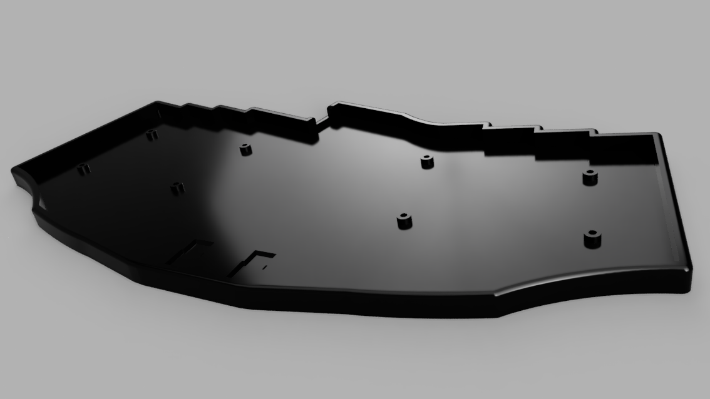

# A 3D-printed case for the reviung_ish keyboard

A 3D-printed case for the ["reviung_ish" keyboard](https://github.com/fredbabe/reviung_ish_pcb) by [oddkeeb](https://github.com/fredbabe), an extended Reviung-style keyboard with added number row and thumb keys.

The case is a tray-style case built around the PCB and adding room on top for a plate (something that doesn't exist but might one day).

There are eight mount points for screws, use something like 3-4 mm M2 screws to fix the PCB to the case (the holes are 3 mm deep so with a standard 1.6 mm PCB then the screws can be no longer than 4 mm to fit, if there's a plate on top though then use 5-6 mm screws).

## Availability

Files are available in F3Z, STEP and STL format, see [the releases page](https://github.com/namnlos-io/reviung_ish_case/releases).

## Images

Below are some renders of the case.

