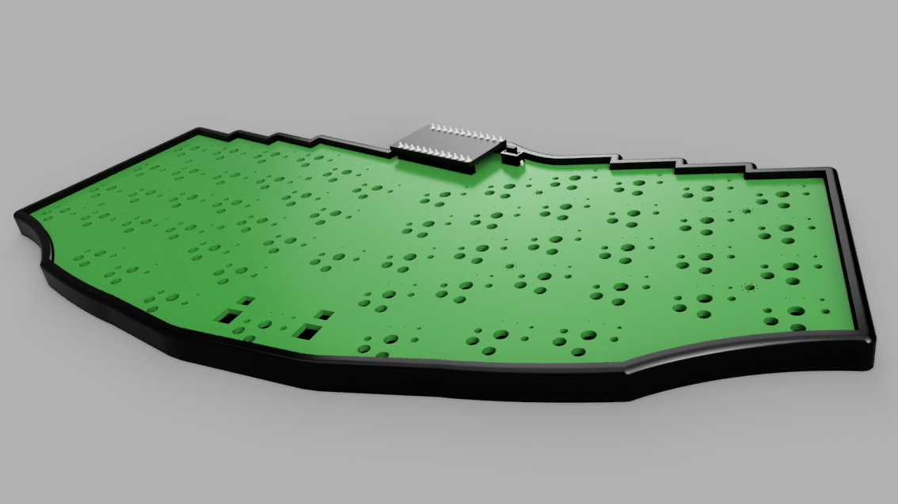

# 3D-printed case for thhe reviung_ish keyboard

A 3D-printed case for the "reviung_ish" keyboard by @fredbabe: <https://github.com/fredbabe/reviung_ish_pcb>.

Files are available in F3Z, STEP and STL format.

## Images

